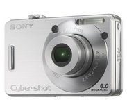
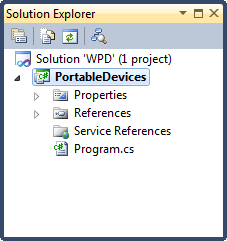
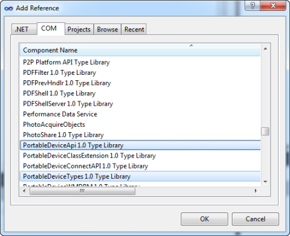
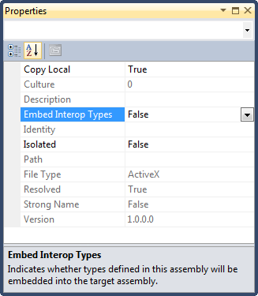
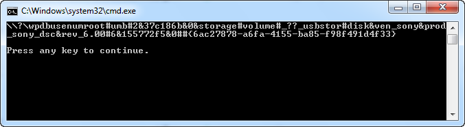
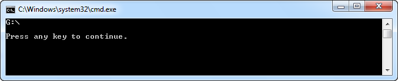
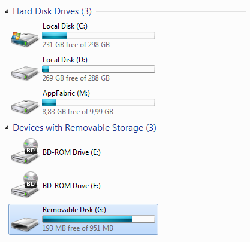

# Enumerating Windows Portable Devices

## Introduction

A week ago I wrote an article about [Windows Image Acquisition (WIA)](https://github.com/geersch/WIA) and demonstrated how you could use it to control your scanner. WIA 2.0 (released with Windows Vista) is mainly targeted towards scanners. For dealing with digital cameras and digital video devices you are better off using the Windows Portable Devices (WDP) API.

Let's explore the WDP API and see what results we get...

## Digital Camera

In order to play with the WDP API you need to hook up a compatible device to your computer. I used a digital camera (Sony Cyber-Shot DSC-W50) which I bought somewhere in 2006, but any WPD-compatible device will suffice.



## Project Setup

Start up Visual Studio 2010 and create a new blank solution named WPD. Next add a new Console Application called PortableDevices to it.



To access the WDP API, you’ll need to add references to the COM libraries “PortableDeviceApi 1.0 Type Library″ and "PortableDeviceTypes 1.0 Type Library".



Afterwards select both references and set the "Embed Interop Types" property to false.



You're now ready to get your hands wet with the WDP API.

## Enumerating WPD Devices

Add a new class to the project called PortableDeviceCollection. This class represents a simple collection which keeps track of PortableDevice instances. When an instance of the PortableDeviceCollection class is created its constructor creates an instance of the PortableDeviceManager type which can be found in the PortableDeviceApi 1.0 Type Library.

```csharp
public class PortableDeviceCollection : Collection<PortableDevice>
{
    private readonly PortableDeviceManager _deviceManager;

    public PortableDeviceCollection()
    {
        this._deviceManager = new PortableDeviceManager();
    }

    public void Refresh()
    {
        //...
    }
}
```

Go ahead and also add a PortableDevice class to the project. Think of this class as a wrapper for each WPD-compatible device. We pass in the device's ID when creating a new instance of this class.

```csharp
public class PortableDevice
{
    public PortableDevice(string deviceId)
    {
        this.DeviceId = deviceId;
    }

    public string DeviceId { get; set; }
}
```

Let's build a collection of WPD-compatible devices by implementing the Refresh() method of the PortableDeviceCollection class.

```csharp
public void Refresh()
{
    this._deviceManager.RefreshDeviceList();

    // Determine how many WPD devices are connected
    var deviceIds = new string[1];
    uint count = 1;
    this._deviceManager.GetDevices(ref deviceIds[0], ref count);

    // Retrieve the device id for each connected device
    deviceIds = new string[count];
    this._deviceManager.GetDevices(ref deviceIds[0], ref count);
    foreach(var deviceId in deviceIds)
    {
        Add(new PortableDevice(deviceId));
    }
}
```

We instruct the PortableDeviceManager to count how many devices are connected to the PC. Next we retrieve the device IDs for each connected device and add a new instance of the PortableDevice class to the collection.

Add the following code to your console application's Main() method and hit F5 to run the application.

```csharp
var collection = new PortableDeviceCollection();

collection.Refresh();

foreach(var device in collection)
{
    Console.WriteLine(device.DeviceId);
}

Console.WriteLine();
Console.WriteLine("Press any key to continue.");
Console.ReadKey();
```

Your output should resemble the following:



That's some device ID. Try pronouncing that five times in a row!

## Connect to a Device

As you can see the device id is not very easy to read. Let's display a friendlier name. But before we can do so, we need to establish a connection with the device. Adjust the PortableDevice class as shown below.

```csharp
public class PortableDevice
{
    private bool _isConnected;
    private readonly PortableDeviceClass _device;

    public PortableDevice(string deviceId)
    {
        this._device = new PortableDeviceClass();
        this.DeviceId = deviceId;
    }

    public string DeviceId { get; set; }

    public void Connect()
    {
        if (this._isConnected) { return; }

        var clientInfo = (IPortableDeviceValues) new PortableDeviceValuesClass();
        this._device.Open(this.DeviceId, clientInfo);
        this._isConnected = true;
    }

    public void Disconnect()
    {
        if (!this._isConnected) { return; }
        this._device.Close();
        this._isConnected = false;
    }
}
```

When an object of the PortableDevice class is instantiated it creates an instance of the PortableDeviceClass type (PortableDeviceApi 1.0 Type Library). This instance's Open() method is used in the Connect() method in order to establish a connection with the device.

**Remark**: When establishing a connection with a device you need to pass in an instance of the PortableDeviceValuesClass class. This instance lets you specify information about the client application that is connecting with the device. For this demo application I did not set any additional information.

## Friendly Name

Once we've established a connection to the device we can retrieve a friendlier name. Add the following property to the PortableDevice class:

```csharp
public string FriendlyName
{
    get
    {
        if (!this._isConnected)
        {
            throw new InvalidOperationException("Not connected to device.");
        }

        // Retrieve the properties of the device
        IPortableDeviceContent content;
        IPortableDeviceProperties properties;
        this._device.Content(out content);
        content.Properties(out properties);

        // Retrieve the values for the properties
        IPortableDeviceValues propertyValues;
        properties.GetValues("DEVICE", null, out propertyValues);

        // Identify the property to retrieve
        var property = new _tagpropertykey();
        property.fmtid = new Guid(0x26D4979A, 0xE643, 0x4626, 0x9E, 0x2B,
                                    0x73, 0x6D, 0xC0, 0xC9, 0x2F, 0xDC);
        property.pid = 12;

        // Retrieve the friendly name
        string propertyValue;
        propertyValues.GetStringValue(ref property, out propertyValue);

        return propertyValue;
    }
}
```

Adjust the code of your application's Main() method as follows and hit F5 to run it.

```csharp
var collection = new PortableDeviceCollection();

collection.Refresh();

foreach(var device in collection)
{
    device.Connect();
    Console.WriteLine(device.FriendlyName);
    device.Disconnect();
}

Console.WriteLine();
Console.WriteLine("Press any key to continue.");
Console.ReadKey();
```

The output contains a friendlier name now.



The digital camera is recognized as a USB mass storage device and has been attributed with a drive letter (G:\\). In Windows Explorer you'll notice an additional drive as well.



I hope you enjoyed this post on the Windows Portable Devices (WPD) API. In one of the following posts I'll discuss how you can retrieve a list of the items (e.g. pictures, movies...) which are stored on the device.
