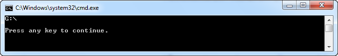

# WPD: Enumerating Content

## Introduction

The previous post on the Windows Portable Devices API shows how you can [enumerate the WPD-compatible devices](http://cgeers.com/2011/05/22/enumerating-windows-portable-devices/) conntected to your computer.

This post picks up where the previous one left off and shows how you can enumerate the contents (e.g. pictures, movies...) which are stored on such a device.

Just like before I hooked up a digital camera to my PC. Let's browse through its contents using the WPD API...

## Source Code

Open the source code of the [first part of this series](../part-1/README.md) in Visual Studio, connect your camera and hit F5 to run the application. It will recognize your WDP device and display its name.

[](http://cgeers.files.wordpress.com/2011/06/wpd.png)

Now let's extend the code so that we can also enumerate the contents of the device.

## PortableDeviceObject

Let's create some class types to represent each folder and file stored on a WPD-compatible device. Add a new class called PortableDeviceObject to the project and add the code shown below to it.

```csharp
public abstract class PortableDeviceObject
{
    protected PortableDeviceObject(string id, string name)
    {
        this.Id = id;
        this.Name = name;
    }

    public string Id { get; private set; }

    public string Name { get; private set; }
}
```

Create a descendant of this abstract class to represent a folder.

```csharp
public class PortableDeviceFolder : PortableDeviceObject
{
    public PortableDeviceFolder(string id, string name) : base(id, name)
    {
        this.Files = new List<PortableDeviceObject>();
    }

    public IList<PortableDeviceObject> Files { get; set; }
}
```

Add another class to represent a file.

```csharp
public class PortableDeviceFile : PortableDeviceObject
{
    public PortableDeviceFile(string id, string name) : base(id, name)
    { }
}
```

A folder and a file both have an id and a name and a folder also contains a collection files and/or other folders. Pretty simple.

## Enumerating Content

Time to enumerate the contents of the camera. Open the PortableDevice class in Visual Studio and add the GetContents() method to it.

```csharp
public PortableDeviceFolder GetContents()
{
    var root = new PortableDeviceFolder("DEVICE", "DEVICE");

    IPortableDeviceContent content;
    this._device.Content(out content);
    EnumerateContents(ref content, root);

    return root;
}
```

We create a new PortableDeviceFolder instance that represent the device itself, "the root" if you will. This is the starting point for enumerating the contents of the device.

Next add the private method EnumerateContents(...) to the PortableDevice class.

```csharp
private static void EnumerateContents(ref IPortableDeviceContent content,
    PortableDeviceFolder parent)
{
    // Get the properties of the object
    IPortableDeviceProperties properties;
    content.Properties(out properties);

    // Enumerate the items contained by the current object
    IEnumPortableDeviceObjectIDs objectIds;
    content.EnumObjects(0, parent.Id, null, out objectIds);

    uint fetched = 0;
    do
    {
        string objectId;

        objectIds.Next(1, out objectId, ref fetched);
        if (fetched > 0)
        {
            var currentObject = WrapObject(properties, objectId);

            parent.Files.Add(currentObject);

            if (currentObject is PortableDeviceFolder)
            {
                EnumerateContents(ref content, (PortableDeviceFolder) currentObject);
            }
        }
    } while (fetched > 0);
}
```

This method enumerates the contents of the current folder (parent) and includes the necessary recursion to parse the contents of any sub-folders. When the GetContents(...) method completes an entire tree structure (root variable) has been built that represents the contents of the device.

The WrapObject(...) method creates an instance of the PortableDeviceFolder or PortableDeviceFile class types depending on the type of the object. For each folder or file it extract the name and type type (folder or file).

```csharp
private static PortableDeviceObject WrapObject(IPortableDeviceProperties properties,
    string objectId)
{
    IPortableDeviceKeyCollection keys;
    properties.GetSupportedProperties(objectId, out keys);

    IPortableDeviceValues values;
    properties.GetValues(objectId, keys, out values);

    // Get the name of the object
    string name;
    var property = new _tagpropertykey();
    property.fmtid = new Guid(0xEF6B490D, 0x5CD8, 0x437A, 0xAF, 0xFC,
                                0xDA, 0x8B, 0x60, 0xEE, 0x4A, 0x3C);
    property.pid = 4;
    values.GetStringValue(property, out name);

    // Get the type of the object
    Guid contentType;
    property = new _tagpropertykey();
    property.fmtid = new Guid(0xEF6B490D, 0x5CD8, 0x437A, 0xAF, 0xFC,
                                0xDA, 0x8B, 0x60, 0xEE, 0x4A, 0x3C);
    property.pid = 7;
    values.GetGuidValue(property, out contentType);

    var folderType = new Guid(0x27E2E392, 0xA111, 0x48E0, 0xAB, 0x0C,
                                0xE1, 0x77, 0x05, 0xA0, 0x5F, 0x85);
    var functionalType = new Guid(0x99ED0160, 0x17FF, 0x4C44, 0x9D, 0x98,
                                    0x1D, 0x7A, 0x6F, 0x94, 0x19, 0x21);

    if (contentType == folderType  || contentType == functionalType)
    {
        return new PortableDeviceFolder(objectId, name);
    }

    return new PortableDeviceFile(objectId, name);
}
```

## Demo Application

Now that we are able to enumerate the contents of the device let's update the demo application so that it displays the contents. Add the following two methods to the Program class of the console application.

```csharp
public static void DisplayObject(PortableDeviceObject portableDeviceObject)
{
    Console.WriteLine(portableDeviceObject.Name);
    if (portableDeviceObject is PortableDeviceFolder)
    {
        DisplayFolderContents((PortableDeviceFolder) portableDeviceObject);
    }
}

public static void DisplayFolderContents(PortableDeviceFolder folder)
{
    foreach (var item in folder.Files)
    {
        Console.WriteLine(item.Id);
        if (item is PortableDeviceFolder)
        {
            DisplayFolderContents((PortableDeviceFolder) item);
        }
    }
}
```

Finally all you need to do is adjust the Main() method as follows:

```csharp
static void Main()
{
    var collection = new PortableDeviceCollection();

    collection.Refresh();

    foreach(var device in collection)
    {
        device.Connect();
        Console.WriteLine(device.FriendlyName);

        var folder = device.GetContents();
        foreach(var item in folder.Files)
        {
            DisplayObject(item);
        }

        device.Disconnect();
    }

    Console.WriteLine();
    Console.WriteLine("Press any key to continue.");
    Console.ReadKey();
}
```

Hit F5 to run the application and you'll receive an output similar to the one below.

[](http://cgeers.files.wordpress.com/2011/06/wpd2.png)

Voila, I hope you enjoyed this post on the Windows Portable Devices (WPD) API.
