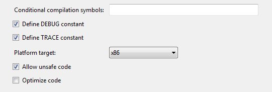

# WPD: Transferring Content

## Introduction

About two months ago I wrote a couple of articles which covered the usage of the [Windows Portable Device API](<http://msdn.microsoft.com/en-us/library/dd389005(v=vs.85).aspx>), namely:

- [Enumerating Windows Portable Devices](../part-1/README.md)
- [WPD: Enumerating Content](../part-2/README.md)

These articles explain how you can detect WPD-compatible devices connected to your PC and how to list their contents. Today I received an e-mail from a reader asking me if it is possible to transfer/download the content of such a device through the WPD API.

No idea actually. Never tried it. Let's find out...

## Source Code

Before you get started, have a quick glance at the previous two articles if you haven't already done so and afterwards use the source of the second article (WPD: Enumerating Content) as a starting point.

Open the solution of the 2nd article in Visual Studio.


It's a simple console application which scans for WPD-compatible devices and lists the contents stored on it. I decided to connect my [Kindle](http://www.google.be/url?sa=t&source=web&cd=1&ved=0CD4QFjAA&url=http%3A%2F%2Fwww.amazon.com%2FKindle-Wireless-Reader-Wifi-Graphite%2Fdp%2FB002Y27P3M&ei=wHtFTtKfO4TBhAeEqcWtBg&usg=AFQjCNFZZAU2Rs7wJzySN2ibsLor7xG0Tw&sig2=qHWL08e0Cr4jFJ-CWhKcJA) for a change and see what I could find on it.


PS: If you don't have a Kindle, get one! It's a fantastic e-reader and the price is more than reasonable. Any other WPD-compatible devices such as a digital camera, web cam...etc. will also do.

## Transferring Content

After a bit of searching I found a MSDN page, which offers a bit more information on the topic of transferring content.

[http://msdn.microsoft.com/en-us/library/dd388996(v=vs.85).aspx](<http://msdn.microsoft.com/en-us/library/dd388996(v=vs.85).aspx>)

Apparently you have to follow these steps in order to transfer content found on a WPD device.

1. Retrieve the ID of the device
2. Create a new IPortableDevice object which represents the device (PortableDeviceClass)
3. Create a new IPortableDeviceContent object to access content-specific methods
4. Create a new IPortableDeviceResources object to access resource-specific methods
5. Retrieve an IStream object to read the data from the device
6. Read the IStream object and copy it to the destination on the PC

We're already halfway there as we've already implemented the first three steps during the first two articles of this series. Let's implement the remaining steps.

Open up the PortableDevice.cs code file and add a new method to it called "DownloadFile".

```csharp
public void DownloadFile(PortableDeviceFile file, string saveToPath)
{
    //...
}
```

This method takes two parameters, the file to transfer and a folder in which to save it. Each file is wrapped in an instance of the PortableDeviceFile type, which is a small wrapper we created in the second article to represent a file residing on a WPD-compatible device.

Now we need to make sure that this method actually performs a useful task. First we need to create a new IPortableDeviceContent object so that we can access content-specific methods.

```csharp
IPortableDeviceContent content;
this._device.Content(out content);
```

Then we must create an IPortableDeviceResources object to access resource-specific methods.

```csharp
IPortableDeviceResources resources;
content.Transfer(out resources);
```

Now we can create an IStream object to read the data from the device.

```csharp
PortableDeviceApiLib.IStream wpdStream;
uint optimalTransferSize = 0;

var property = new _tagpropertykey();
property.fmtid = new Guid(0xE81E79BE, 0x34F0, 0x41BF, 0xB5, 0x3F,
                          0xF1, 0xA0, 0x6A, 0xE8, 0x78, 0x42);
property.pid = 0;

resources.GetStream(file.Id, ref property, 0, ref optimalTransferSize,
                    out wpdStream);

System.Runtime.InteropServices.ComTypes.IStream sourceStream =
    (System.Runtime.InteropServices.ComTypes.IStream) wpdStream;
```

Finally it's simply a matter of reading the stream and saving it to a file.

```csharp
var filename = Path.GetFileName(file.Id);
FileStream targetStream = new FileStream(Path.Combine(saveToPath, filename),
    FileMode.Create, FileAccess.Write);

unsafe
{
    var buffer = new byte[1024];
    int bytesRead;
    do
    {
        sourceStream.Read(buffer, 1024, new IntPtr(&bytesRead));
        targetStream.Write(buffer, 0, 1024);
    } while (bytesRead > 0);

    targetStream.Close();
}
```

The previous code denotes an [unsafe](<http://msdn.microsoft.com/en-us/library/chfa2zb8(v=VS.71).aspx>) context because there is some pointer magic happening ([IntPtr](http://msdn.microsoft.com/en-us/library/system.intptr.aspx)).

Don't forget to check the "Allow unsafe code" option in the project's Build options.

1. Right-click on the project in the solution explorer
2. Select Properties
3. Navigate to the Build tab
4. Check the option "Allow unsafe code"

If you don't enable this option the compiler will throw an error.



## Demo Application

Now we can slightly adjust the demo application. Just open up the Program.cs code file and add the following bit of code to the DisplayFolderContents(...) method. Place it inside of the foreach loop.

```csharp
if (item is PortableDeviceFile)
{
  device.DownloadFile((PortableDeviceFile)item, @"c:\kindle\");
}
```

If you run the demo application you'll notice that the contents of your Kindle (or other device) are copied to your local hard drive. Here I used the hard-coded folder "C:\\Kindle" (Hey, it's a demo).

It took me a bit or searching and trial and error to get this working. There isn't a lot of information available where you're trying to use the WPD API in a managed environment. [An official managed wrapper for .NET would be nice](http://connect.microsoft.com/VisualStudio/feedback/details/530040/official-wpd-windows-portable-devices-managed-wrapper-for-net).
