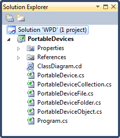
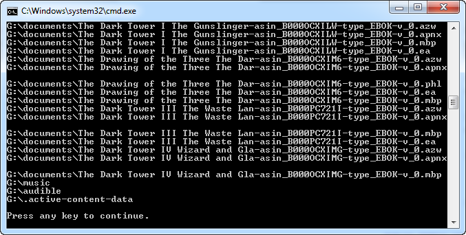
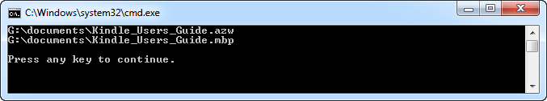

# WPD: Deleting Resources

## Introduction

Last year I wrote three articles about the Windows Portable Devices (WDP) API, namely:

- [Enumerating Windows Portable Devices](../part-1/README.md)
- [WPD: Enumerating Content](../part-2/README.md)
- [WPD: Transferring Content](../part-3/README.md)

Regularly I get questions asking me how to add or delete resources from a WPD compatible device. Let's focus on removing resources first. Mayhap I'll write another post about adding resources next time.

I'm going to connect my Kindle and see if I can't delete a book from it.

## Source Code

If you haven't read the previous articles of this series yet, then do so now or at least have a quick glance at them.

Start Visual Studio and open the solution of the third article.



Open the Program.cs code file and delete everything, but leave an empty Main() method. We want to start with a clean slate.

## Content

Before we start deleting resources, let's first find out what is stored on the device. Let's establish a connection with the device.

```csharp
var devices = new PortableDeviceCollection();
devices.Refresh();
var kindle = devices.First();
kindle.Connect();
```

Now let's retrieve the resources of the root folder and enumerate over them.

```csharp
var root = kindle.GetContents();
foreach (var resource in root.Files)
{
    DisplayResourceContents(resource);
}
```

Each resource located in the root can either be a file or another folder. The DisplayResourceContents(...) methods displays the resource's name and if it's a folder it lists its contents.

```csharp
public static void DisplayResourceContents(
    PortableDeviceObject portableDeviceObject)
{
    Console.WriteLine(portableDeviceObject.Name);
    if (portableDeviceObject is PortableDeviceFolder)
    {
        DisplayFolderContents((PortableDeviceFolder) portableDeviceObject);
    }
}
```

The DisplayFolderContents(...) method is a recursive methods which drills down all the subfolders.

```csharp
public static void DisplayFolderContents(
    PortableDeviceFolder folder)
{
    foreach (var item in folder.Files)
    {
        Console.WriteLine(item.Id);

        if (item is PortableDeviceFolder)
        {
            DisplayFolderContents((PortableDeviceFolder) item);
        }
    }
}
```

If you run the code now, you'll get a list of all the resources which are stored on your device. Or in my case, a list of the books stored on my Kindle.



The PortableDeviceCollection, PortableDeviceObject, PortableDeviceFolder ... types which I used here are wrappers around types such as PortableDeviceManager imported from the “PortableDeviceApi 1.0 Type Library″ and “PortableDeviceTypes 1.0 Type Library” COM libraries. Take a look at the second article of this series, [WPD: Enumerating Content](../part-2/README.md), for a more in-depth explanation on how to enumerate the resources on your device.

## What to delete?

Before you can delete a resource you need to get a hold of its ID. Each file or folder has a unique ID.

Here I execute a naive LINQ query which selects the documents folder from the Kindle.

```csharp
PortableDeviceFolder documents =
    (from r in ((PortableDeviceFolder)root.Files[0]).Files
     where r.Name.Contains("documents")
     select r).First() as PortableDeviceFolder;
```

Let's delete the Users Guide, I'm not going to read it. Start Kindle, select book, click next or previous...how difficult can it be.

The book is made up out of two resources. A \*.azw ([Amazon Word](http://wiki.mobileread.com/wiki/AZW)) and a \*.mbp file (contains bookmarks, annotations, last read page...etc).

```csharp
var books = from b in documents.Files
            where b.Name.Contains("Kindle_Users_Guide")
            select b;
```

And their IDs are:

```csharp
foreach (PortableDeviceFile book in books)
{
    Console.WriteLine(book.Id);
}
```



## Deleting Resources

Time to delete the users guide. Open the PortableDevice.cs code file and add a new method called DeleteFile(...) to the PortableDevice class.

```csharp
public void DeleteFile(PortableDeviceFile file)
{
    //...
}
```

First you need to get an [IPortableDeviceContent](<http://msdn.microsoft.com/en-us/library/windows/desktop/dd388529(v=vs.85).aspx>) instance with which you can create, enumerate, examine and delete content on a device.

```csharp
IPortableDeviceContent content;
this._device.Content(out content);
```

Next you need to identify the resource which you want to delete. IPortableDeviceContent offers a Delete(...) method which requires an [IPortableDevicePropVariantCollection](<http://msdn.microsoft.com/en-us/library/windows/desktop/dd388719(v=vs.85).aspx>). This interface holds a collection of PROPVARIANT values which identify the resources to delete.

You need to convert the ID of the resource, which is a string, to a PROPVARIANT. The PROPVARIANT is represented by the tag_inner_PROPVARIANT type found in the imported PortableDeviceApiLib COM library. Luckily one member of the WPD team explained how to do this in C# about five years ago.

[http://blogs.msdn.com/b/dimeby8/archive/2007/01/08/creating-wpd-propvariants-in-c-without-using-interop.aspx](http://blogs.msdn.com/b/dimeby8/archive/2007/01/08/creating-wpd-propvariants-in-c-without-using-interop.aspx)

Let's borrow his StringToPropVariant method and add it to our PortableDevice class.

```csharp
private static void StringToPropVariant(
    string value,
    out PortableDeviceApiLib.tag_inner_PROPVARIANT propvarValue)
{
    PortableDeviceApiLib.IPortableDeviceValues pValues =
        (PortableDeviceApiLib.IPortableDeviceValues)
            new PortableDeviceTypesLib.PortableDeviceValuesClass();

    var WPD_OBJECT_ID = new _tagpropertykey();
    WPD_OBJECT_ID.fmtid =
        new Guid(0xEF6B490D, 0x5CD8, 0x437A, 0xAF, 0xFC, 0xDA,
                    0x8B, 0x60, 0xEE, 0x4A, 0x3C);
    WPD_OBJECT_ID.pid = 2;

    pValues.SetStringValue(ref WPD_OBJECT_ID, value);

    pValues.GetValue(ref WPD_OBJECT_ID, out propvarValue);
}
```

Now you can convert the ID of a resource to a PROPVARIANT and add it to a IPortableDevicePropVariantCollection.

```csharp
var variant = new PortableDeviceApiLib.tag_inner_PROPVARIANT();
StringToPropVariant(file.Id, out variant);

PortableDeviceApiLib.IPortableDevicePropVariantCollection objectIds =
    new PortableDeviceTypesLib.PortableDevicePropVariantCollection()
    as PortableDeviceApiLib.IPortableDevicePropVariantCollection;
objectIds.Add(variant);
```

The preparations are done and all that remains is to delete the resource. Just call the [IPortableDeviceContent's Delete(...) method](<http://msdn.microsoft.com/en-us/library/windows/desktop/dd388536(v=vs.85).aspx>).

Pass zero for the first parameter, then the ID's (PROPVARIANTs) of the resource you want to delete and ignore the results. We'll be naive and hope all goes well. Improve on this if you will and inspect if all went as expected.

```csharp
content.Delete(0, objectIds, null);
```

Now you can delete the resources associated with the users guide.

```csharp
foreach (PortableDeviceFile book in books)
{
    kindle.DeleteFile(book);
}
```

Voila, that's all there is to it. Best to backup your resources before you start experimenting with this code!
