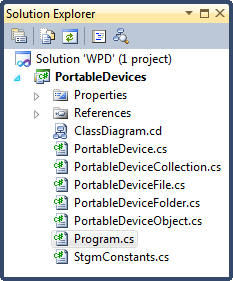

# WPD: Transfer Content To A Device

## Introduction

Mayhap came here sooner than I thought. The previous article on the WPD API dealt with deleting resources. Too destructive perhaps, let's create some resources this time.

My Kindle's is hooked up to my PC. Let's see if I can transfer a book to it.

## TransferContentToDevice Method

Open the source code of the fourth article ([WPD: Deleting Resources](../part-4/README.md)) in Visual Studio.



In the Solution Explorer select the Program.cs file and open it. Clear the Main(...) method and add the following code to it.

```csharp
var devices = new PortableDeviceCollection();
devices.Refresh();
var kindle = devices.First();
kindle.Connect();

kindle.TransferContentToDevice(
    @"d:\temp\Kindle_Users_Guide.azw",
    @"g:\documents");

kindle.Disconnect();
```

First we establish a connection to the Kindle, copy the book to it and finally disconnect from it

The magic happens in the TransferContentToDevice(...) method, which takes two parameters:

- **fileName**: Full path of the file which you want to copy to the device
- **parentObjectId**: The ID of the parent folder into which you want to copy the file

Modify the values of these parameters to suit your situation.

## Required Properties

Before we can start to implement the TransferContentToDevice(...) method we first need to add another private method to the PortableDevice class type.

```csharp
private IPortableDeviceValues GetRequiredPropertiesForContentType(
    string fileName,
    string parentObjectId)
{
    //...
}
```

Before you can upload a resource to a device you need to collect some information about it. This information is stored in a [IPortableDeviceValu](<http://msdn.microsoft.com/en-us/library/windows/desktop/dd319461(v=vs.85).aspx>)es collection.

Depending on the resource type you may need to collect more data (or properties) that describe the resource. Keep that it mind, the number of required properties might differ for your situation.

For adding a book to a Kindle you need to know the following information:

- **WPD_OBJECT_PARENT_ID**: The ID of the folder into which you want to upload the resource
- **WPD_OBJECT_SIZE**: The size of the object (in bytes)
- **WPD_OBJECT_ORIGINAL_FILE_NAME**: The original filename of the object
- **WPD_OBJECT_NAME**: The name of the object as you wish to represent it on the device

Time to implement the method. First you need to create a IPortableDeviceValues collection.

```csharp
IPortableDeviceValues values =
    new PortableDeviceTypesLib.PortableDeviceValues() as IPortableDeviceValues;
```

Then you can add the WPD_OBJECT_PARENT_ID to the collection:

```csharp
var WPD_OBJECT_PARENT_ID = new _tagpropertykey();
WPD_OBJECT_PARENT_ID.fmtid =
    new Guid(0xEF6B490D, 0x5CD8, 0x437A, 0xAF, 0xFC,
                0xDA, 0x8B, 0x60, 0xEE, 0x4A, 0x3C);
WPD_OBJECT_PARENT_ID.pid = 3 ;
values.SetStringValue(ref WPD_OBJECT_PARENT_ID, parentObjectId);
```

Adding the rest of the properties is similar.

```csharp
FileInfo fileInfo = new FileInfo(fileName);
var WPD_OBJECT_SIZE = new _tagpropertykey();
WPD_OBJECT_SIZE.fmtid =
    new Guid(0xEF6B490D, 0x5CD8, 0x437A, 0xAF, 0xFC,
                0xDA, 0x8B, 0x60, 0xEE, 0x4A, 0x3C);
WPD_OBJECT_SIZE.pid = 11;
values.SetUnsignedLargeIntegerValue(WPD_OBJECT_SIZE, (ulong) fileInfo.Length);

var WPD_OBJECT_ORIGINAL_FILE_NAME = new _tagpropertykey();
WPD_OBJECT_ORIGINAL_FILE_NAME.fmtid =
    new Guid(0xEF6B490D, 0x5CD8, 0x437A, 0xAF, 0xFC,
                0xDA, 0x8B, 0x60, 0xEE, 0x4A, 0x3C);
WPD_OBJECT_ORIGINAL_FILE_NAME.pid = 12;
values.SetStringValue(WPD_OBJECT_ORIGINAL_FILE_NAME, Path.GetFileName(fileName));

var WPD_OBJECT_NAME = new _tagpropertykey();
WPD_OBJECT_NAME.fmtid =
    new Guid(0xEF6B490D, 0x5CD8, 0x437A, 0xAF, 0xFC,
                0xDA, 0x8B, 0x60, 0xEE, 0x4A, 0x3C);
WPD_OBJECT_NAME.pid = 4;
values.SetStringValue(WPD_OBJECT_NAME, Path.GetFileName(fileName));
```

**Remark**: To keep it easy I extracted the filename and path of the book and used that to set both the WPD_OBJECT_ORIGINAL_FILE_NAME and WPD_OBJECT_NAME properties.

Last but not least, don't forget to return the collection.

```csharp
return values;
```

## Transferring Content

Now that you can gather all the required properties you can start transferring content to the device. Let's implement the TransferContentToDevice(...) method.

Get an [IPortableDeviceContent](<http://msdn.microsoft.com/en-us/library/windows/desktop/dd388529(v=vs.85).aspx>) interface to access resource specific methods.

```csharp
IPortableDeviceContent content;
this._device.Content(out content);
```

Now using the GetRequiredPropertiesForContentType(...) method retrieve the required properties for the resource you want to upload.

```csharp
IPortableDeviceValues values =
    GetRequiredPropertiesForContentType(fileName, parentObjectId);
```

Then get an [IStream](<http://msdn.microsoft.com/en-us/library/windows/desktop/dd388542(v=vs.85).aspx>) and the optimal buffer size to transfer the resource. This can be done by using the [CreateObjectWithPropertiesAndData](<http://msdn.microsoft.com/en-us/library/windows/desktop/dd388534(v=vs.85).aspx>)(...) method of the IPortableDeviceContent instance.

```csharp
PortableDeviceApiLib.IStream tempStream;
uint optimalTransferSizeBytes = 0;
content.CreateObjectWithPropertiesAndData(
    values,
    out tempStream,
    ref optimalTransferSizeBytes,
    null);
```

Convert the IStream to an [System.Runtime.InteropService.ComTypes.IStream](http://msdn.microsoft.com/en-us/library/system.runtime.interopservices.comtypes.istream.aspx).

```csharp
System.Runtime.InteropServices.ComTypes.IStream targetStream =
    (System.Runtime.InteropServices.ComTypes.IStream) tempStream;
```

All that remains is to open a FileStream, read the source file and write it to the target stream. Make sure you close the IStream afterwards (try...finally).

```csharp
try
{
    using (var sourceStream =
        new FileStream(fileName, FileMode.Open, FileAccess.Read))
    {
        var buffer = new byte[optimalTransferSizeBytes];
        int bytesRead;
        do
        {
            bytesRead = sourceStream.Read(
                buffer, 0, (int)optimalTransferSizeBytes);
            IntPtr pcbWritten = IntPtr.Zero;
            targetStream.Write(
                buffer, (int)optimalTransferSizeBytes, pcbWritten);
        } while (bytesRead > 0);
    }
    targetStream.Commit(0);
}
finally
{
    Marshal.ReleaseComObject(tempStream);
}
```

And that is all she wrote. As always it's best to backup your resources before you start experimenting with this code!
